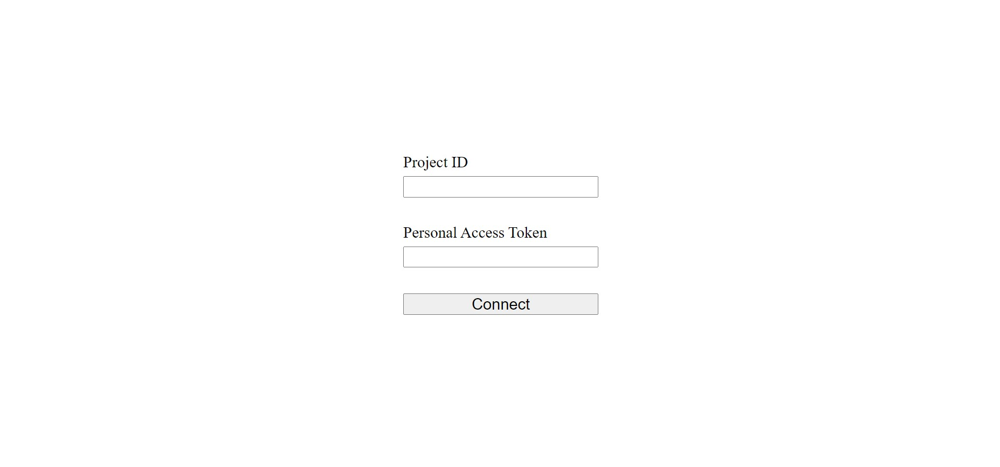

<h1>Crowdin integration app</h1>
<h2>Demo</h2>

<h2>To run the application:</h2>

- Clone or download source code from current Github repository.

- Run npm init

- Create env variables

- Run the server with npm run start

- Enjoy!
